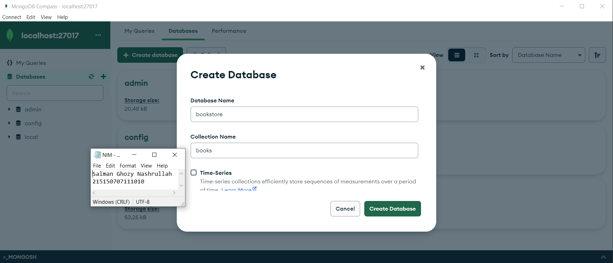
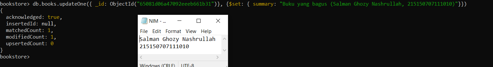

# Pemrograman-Integratif-A_215150707111010_Salman-Ghozy-Nashrullah

<h1>Langkah Percobaan</h1>
<h2>MongoDB Compass</h2>
<h3>Langkah ke-1</h3>

Melakukan koneksi ke MongoDB menggunakan <i>connection string</i>

<h3>Langkah ke-2</h3>

Buat <i>database</i> dengan melakukan klik <i>Create Database</i>

<h3>Langkah ke-3</h3>

Melakukan <i>insert</i> buku pertama dengan melakukan klik <i>Add Data</i>, pilih <i>Insert
Document</i>, isi dengan data yang diinginkan dan klik <i>Insert</i>

<h3>Langkah ke-4</h3>

Melakukan <i>insert</i> buku kedua dengan cara yang sama seperti langkah ketiga

<h3>Langkah ke-5</h3>

Lakukan pencarian buku dengan author <b>Osamu Dazai</b> dengan mengisi <i>filter</i> yang
diinginkan dan klik <i>Find</i>

<h3>Langkah ke-6</h3>

Lakukan perubahan <i>summary</i> pada buku <b><i>No Longer Human</b></i> menjadi <b><i>Buku yang bagus (Salman Ghozy Nashrullah, 215150707111010)</i></b> dengan melakukan klik <i>Edit Document</i> (berlambang pensil), mengisi nilai <i>summary</i> yang baru, dan melakukan klik <i>Update</i>

<h3>Langkah ke-7</h3>

Melakukan penghapusan buku <b><i>I Am Cat</i></b> dengan melakukan klik <i>Remove Document</i> (berlambang tong sampah) dan melakukan klik <i>Delete</i>

<h2>MongoDB Shell</h2>
<h3>Langkah ke-1</h3>

Lakukan koneksi ke <i>MongoDB Server</i> dengan menjalankan <i>command <b>mongosh</b></i> bagi yang menggunakan terminal <i>build in OS</i> sehingga tampilan terminal menjadi seperti berikut

<h3>Langkah ke-2</h3>

Melihat list <i>database</i> yang ada di <i>server</i> dengan menjalankan perintah <i><b>show dbs</b></i>  

<h3>Langkah ke-3</h3>

Berpindah ke <i> database bookstore</i> dengan menggunakan perintah <b><i>use bookstore</i></b>pastikan berpindah ke <i>database</i> yang benar dengan melihat tulisan tanda <i> > </i>

<h3>Langkah ke-4</h3>

Melihat <i>Collection</i> yang ada pada <i>database</i> dengan menggunakan perintah <i><b>show collection</b></i> 

<h3>Langkah ke-5</h3>

Lakukan insert buku <b><i>Overlord I</i></b> dengan menggunakan <b><i>commanddb.books.insertOne({<i>data yang ingin dimasukkan</i>})</b></i> , setelah <i>insert</i> buku berhasil maka <i>MongoDB</i> akan mengembalikan pesan tersebut

<h3>Langkah ke-6</h3>

Melakukan <i>insert</i> buku <b><i>The Setting Sun</b></i> dan <b>Hujan</b> dengan <i>insert many</i> dengan menggunakan <i>command <b>db.books.insertMany({data yang ingin dimasukkan})</b></i> , dan akan mengembalikan pesan tersebut

<h3>Langkah ke-7</h3>

Lakukan pencarian buku dengan menggunakan <i>command</i> <b><i>db.books.find()</b></i> untuk melakukan pencarian semua buku.

<h3>Langkah ke-8</h3>

Menampilkan seluruh buku dengan <i>author</i> <b>Osamu Dazai</b> dengan mengisi <i>argument</i> pada <i>find()</i> dengan menggunakan <i>command</i> <i><b>db.books.find({filter yang ingin diisi})</b></i>

<h3>Langkah ke-9</h3>

Melakukan perubahan <i>summary</i> pada buku <b>Hujan</b> menjadi <i>Buku yang bagus (Salman Ghozy Nashrullah,215150707111010)</i> dengan mengunakan <i>command</i> <i><b>db.books updateOne({filter}, {$set: {data yang akan di update}})</b></i> sehingga <i>output</i> yang dihasilkan oleh <i>MongoDB</i> akan menjadi seperti berikut

<h3>Langkah ke-10</h3>

Melakukan perubahan <i>publisher</i> menjadi <i>Yen Press</i> pada semua buku <i>Osamu Dazai</i> dengan menggunakan <i>command</i> <b><i>db.books.updateMany({filter}, {$set: {data yang akan di update}})</i></b>

<h3>Langkah ke-11</h3>

Melakukan penghapusan pada buku <i><b>Overlord I</i></b> dengan menggunakan <i>command</i> <i><b>db.books.deleteOne({argument})</i></b>

<h3>Langkah ke-12</h3>

Lakukan penghapusan pada semua buku <b>Osamu Dazai</b> dengan menggunakan <i>command</i> <i><b>db.books.deleteMany({argument})</i></b>

